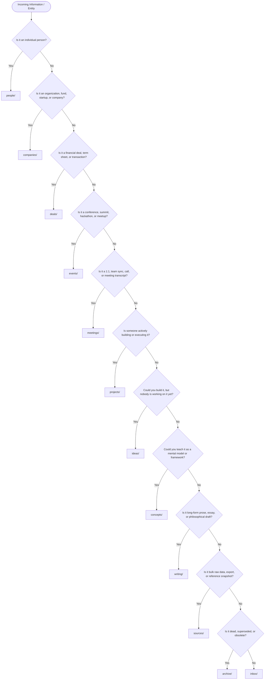

# RESOLVER.md — Master Decision Tree

> **CRITICAL AGENT INSTRUCTION:**
> You **MUST** read this file before creating, moving, or refiling any page in the knowledge base.
> Knowledge bases rot when the same entity or concept lives in multiple places.
> This decision tree guarantees that every piece of knowledge lands in exactly **one primary directory**.

---

## The Master Filing Decision Tree

Follow this numbered decision tree in order from top to bottom. File in the **first** matching category:

### Detailed Decision Steps

1. **Is it an individual human being?**
   --> `people/` (Slug: `first-last.md`)
   *Check `aliases` across all existing people pages before creating.*

2. **Is it an organization, company, institution, VC fund, or brand?**
   --> `companies/` (Slug: `company-name.md`)

3. **Is it a specific financial transaction, term sheet, investment, or acquisition?**
   --> `deals/` (Slug: `entity-round-year.md` or `company-partner-deal.md`)

4. **Is it an industry conference, developer summit, hackathon, demo day, workshop, or meetup?**
   --> `events/` (Slug: `YYYY-MM-DD-event-name.md`)

5. **Is it a record, summary, action items, or transcript of a specific meeting/call?**
   --> `meetings/` (Slug: `YYYY-MM-DD-topic-or-participants.md`)

6. **Is it an active initiative with a repository, specification, assigned owner, or active build?**
   --> `projects/` (Slug: `project-name.md`)

7. **Is it a raw possibility or product feature that could be built, but has no active work?**
   --> `ideas/` (Slug: `idea-name.md`)

8. **Is it a reusable mental model, design pattern, framework, or concept you could teach?**
   --> `concepts/` (Slug: `concept-name.md`)

9. **Is it developed prose, essay, article, or narrative writing?**
   --> `writing/` (Slug: `title-or-topic.md`)

10. **Is it a bulk export, large dataset snapshot, or immutable external archive?**
    --> `sources/` (Slug: `source-name-YYYY-MM-DD.md`)

11. **Is it a retired, dead, or superseded note preserved solely for history?**
    --> `archive/`

12. **Ambiguous / Unclassified / Quick Capture?**
    --> `inbox/` (Temporary staging. Flagged for categorization during linting).

---

## Disambiguation Rules (Breaking Ties)

When an entity or idea sits on the boundary between two directories:

- **Event vs. Meeting:**
  - A multi-person public or industry gathering, summit, hackathon, or conference with dates, venue/URL, speakers, and broader themes --> `events/`
  - A focused 1:1, internal team sync, board meeting, or customer interview call with specific attendees, transcripts, and immediate action items --> `meetings/`
- **Event vs. Project:**
  - The gathering/conference/launch event itself --> `events/`
  - The ongoing codebase, product spec, or software being built and showcased --> `projects/`
  - *Rule:* File under `events/` and cross-link to the relevant `projects/` entity.
- **Concept vs. Idea:**
  - Could you *teach* it as a mental model or universal framework? --> `concepts/`
  - Could you *build* or implement it as a software feature/product? --> `ideas/`
- **Idea vs. Project:**
  - Is anyone actively writing code, assigning tasks, or executing? --> `projects/`
  - Is it purely hypothetical or awaiting prioritization? --> `ideas/`
  - *Graduation moment:* When work starts on an idea, move the file from `ideas/` to `projects/` and log the transition.
- **Concept vs. Writing:**
  - A concept page is concise, structured compiled truth ($\sim$200–500 words). --> `concepts/`
  - A writing page is long-form prose, narrative, or developed argumentation. --> `writing/`
- **Person vs. Company:**
  - Focuses on the human, their career arc, beliefs, and interactions. --> `people/`
  - Focuses on the organization, metrics, market position, and products. --> `companies/`
  - *Rule:* Create both pages and cross-link them with typed relationships.
- **Meeting vs. Project / Person:**
  - A meeting file captures the chronological event, raw transcript, and specific action items. --> `meetings/`
  - Action items and insights from meetings must be extracted to enrich the relevant `people/`, `companies/`, or `projects/` pages.
- **Sources vs. `.raw/` sidecars:**
  - Data specific to a single person or company (API payload, LinkedIn scrape) --> `people/.raw/slug-date.json` or `companies/.raw/slug-date.json`
  - Multi-entity bulk datasets, chat exports, or book PDFs --> `sources/`

---

## MECE Directory Map

| Directory | Resolver Summary | Primary Entity | Slug Convention |
|---|---|---|---|
| [`people/`](people/README.md) | Individual human beings | Person | `first-last.md` |
| [`companies/`](companies/README.md) | Organizations, startups, VC funds, institutions | Company / Org | `company-name.md` |
| [`deals/`](deals/README.md) | Financial rounds, investments, term sheets | Deal | `company-round-year.md` |
| [`events/`](events/README.md) | Conferences, summits, hackathons, demo days, meetups | Event | `YYYY-MM-DD-event-name.md` |
| [`meetings/`](meetings/README.md) | Records, transcripts, and action items of calls | Meeting | `YYYY-MM-DD-title.md` |
| [`projects/`](projects/README.md) | Active builds with specs, repos, or owners | Project | `project-name.md` |
| [`ideas/`](ideas/README.md) | Possibilities not yet in development | Idea | `idea-name.md` |
| [`concepts/`](concepts/README.md) | Frameworks, mental models, reusable patterns | Concept | `concept-name.md` |
| [`writing/`](writing/README.md) | Essays, articles, drafts, philosophy | Writing | `title-or-topic.md` |
| [`sources/`](sources/README.md) | Bulk raw inputs, snapshots, reference data | Source Data | `source-name-date.md` |
| [`inbox/`](inbox/README.md) | Unsorted quick captures (temporary) | Staging Note | `slug.md` |
| [`archive/`](archive/README.md) | Retired or superseded files | Obsolete Record | `original-slug.md` |
